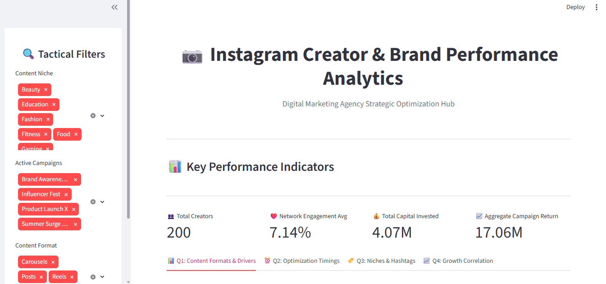
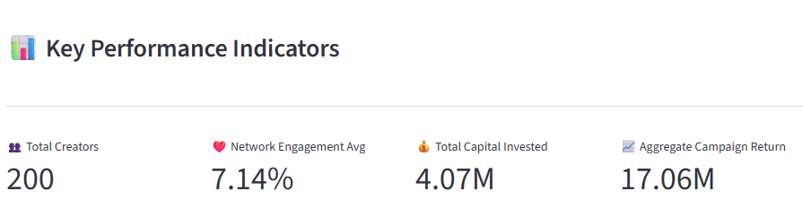
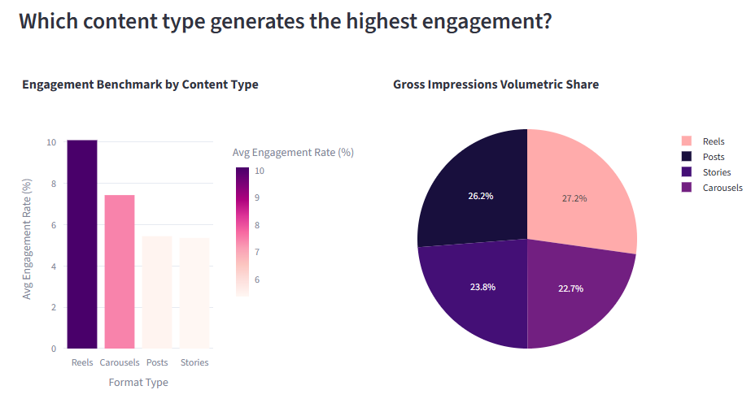
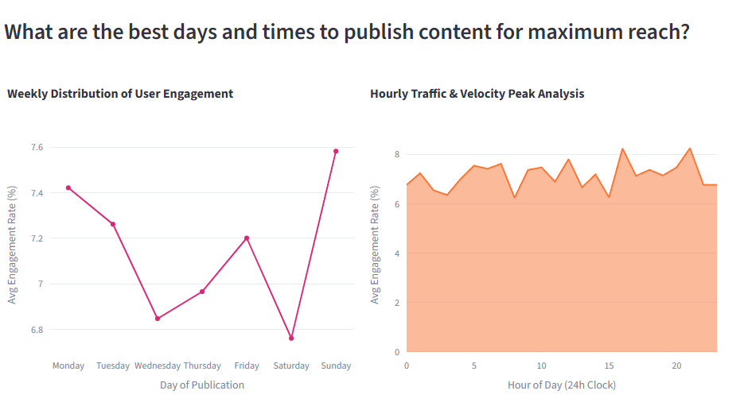
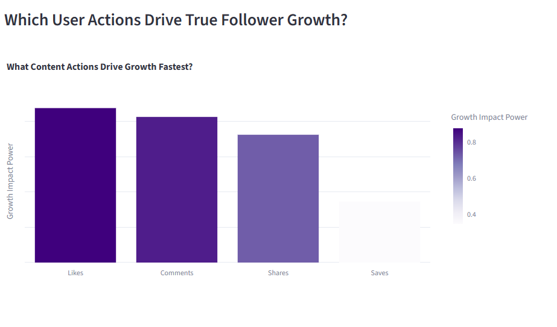
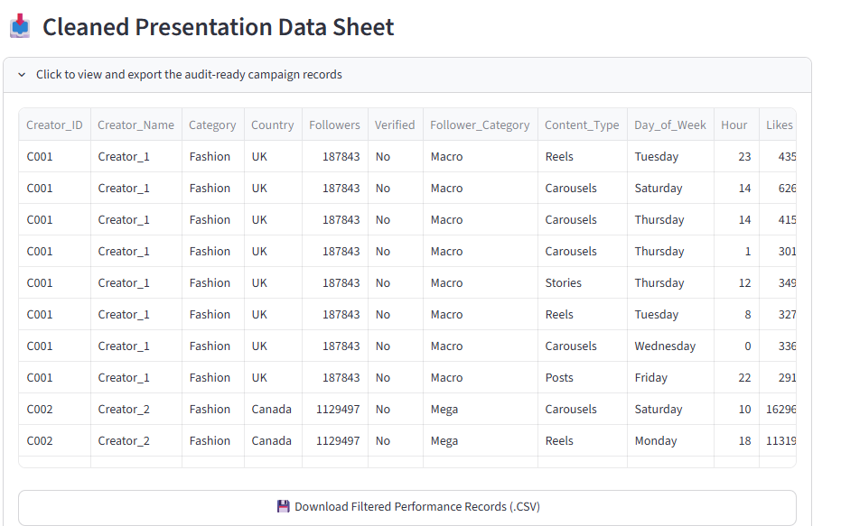

#  Instagram Creator & Brand Performance Analytics Dashboard


A business intelligence dashboard built using **Streamlit**, **Python**, **Pandas**, and **Plotly** to analyze Instagram creator performance, engagement metrics, campaign ROI, and audience growth.

---

#  Dashboard Screenshots

##  Home Dashboard



---

##  KPI Dashboard



---

##  Content Performance



---

##  Best Posting Time



---

## 🏷 Category Analysis


---

##  Growth Analysis



---

##  Export Data



---

#  Features

- Executive KPI Dashboard
- Interactive Sidebar Filters
- Engagement Analytics
- Campaign ROI Analysis
- Content Performance Comparison
- Best Posting Time Analysis
- Category Performance
- Hashtag Analysis
- Follower Growth Analysis
- CSV Download
- Interactive Plotly Charts

---

#  Project Structure

```text
my_dashboard_app/
│
├── .streamlit/
│   └── config.toml
│
├── data/
│   └── filtered_data.csv
│
├── screenshots/
│   ├── home_dashboard.png
│   ├── kpi_dashboard.png
│   ├── content_performance.png
│   ├── posting_time.png
│   ├── category_analysis.png
│   ├── growth_analysis.png
│   └── export_data.png
│
├── src/
│   ├── __init__.py
│   ├── data_loader.py
│   └── chart_utils.py
│
├── app.py
├── requirements.txt
└── README.md
```

---

# Dashboard Modules

##  Executive Dashboard

- Total Creators
- Average Engagement
- Campaign Investment
- Campaign ROI

---

##  Content Analytics

- Reels
- Posts
- Stories
- Carousels

Compare engagement across different content types.

---

##  Publishing Time Analysis

Discover

- Best Day
- Best Time

to maximize engagement.

---

##  Category & Hashtag Analysis

Analyze

- Category Performance
- Top Hashtags
- Impressions
- Engagement Rate

---

##  Growth Driver Analysis

Measure how

- Likes
- Comments
- Shares
- Saves

influence follower growth.

---

##  Export

Download filtered data in CSV format.

---

#  Tech Stack

| Technology | Usage |
|------------|-------|
| Python | Programming |
| Streamlit | Dashboard |
| Pandas | Data Processing |
| Plotly | Visualization |
| NumPy | Numerical Computing |

---

#  Installation

Clone the repository

```bash
git clone https://github.com/yourusername/my_dashboard_app.git
```

Go to the project folder

```bash
cd my_dashboard_app
```

Install dependencies

```bash
pip install -r requirements.txt
```

Run the application

```bash
streamlit run app.py
```

---

# Requirements

```text
streamlit
pandas
plotly
numpy
```

---

# Business Insights

✔ Identify high-performing creators

✔ Discover the best content formats

✔ Optimize publishing schedules

✔ Analyze campaign ROI

✔ Track engagement trends

✔ Understand follower growth

✔ Make data-driven marketing decisions

---

# 🔮 Future Improvements

- Login Authentication
- Dark Theme
- AI Recommendations
- Instagram API Integration
- Database Connectivity
- Predictive Analytics
- Report Generation

---

# 👩‍💻 Author

**Malathi R**

Junior Data Analyst

- Python
- SQL
- Excel
- Power BI
- Streamlit
- Java

---

# ⭐ Star this repository if you found it helpful!